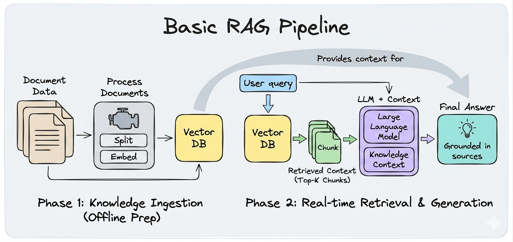

# RAG Chatbot

# What is RAG?
**Retrieval-Augmented Generation** (RAG): 
```
it stops an LLM from making things up by forcing it to read your documents before answering.
```

## Example’s how chatbot looks like: 
You build a chatbot using ChatGPT or Claude. 
                    |
                    ▼ 
A user asks “what’s your return policy?” 
                    |
                    ▼ 
But the LLM (like ChatGPT or Claude) doesn’t know your return policy — it was trained on the internet, not your business docs.
                    |
                    ▼ 
So it either says “I don’t know” or worse, it confidently makes something up (this is called hallucination, and it’s a real problem).
```
RAG fixes this by saying: before the LLM answers, go find the relevant part of the document first, then answer based on that.
```

## Here’s how RAG chatbot actually works under the hood. 


There are two phases:
## Phase 1: Indexing (done once, offline)
You take your documents — a PDF, a website, a FAQ file — and you process them:
1. Split them into smaller chunks (500 words or so)
2. Embed each chunk — convert it into a vector, a list of numbers that captures the meaning
3. Store those vectors in a vector database (ChromaDB, Pinecone, etc.)

## Phase 2: Querying (every time a user asks something)
1. Take the user’s question and embed it — same model, same vector space
2. Search the vector database for chunks whose vectors are closest to the question vector
3. Take the top matching chunks and pass them to the LLM as context
4. The LLM reads those chunks and generates an answer grounded in your actual documents


# Example 1: Small Data with google gemini api key - simple
```streamlit run src/app_google.py ```

## Simple Overview:
```
user question → embed → vector search → LLM → answer
```

## Proper flow overview:
```
                                                                                
[ Document ] ──> [ Text Chunks ] ──> [ Embedding Model ] ──> [ Vector Base ] (Path ①: Small Data)
                                                                      │
                                                                      ▼
[ Query ] ──> [ Text Chunks ] ──> [ Embedding Model ] ──────────────> ① Dot Product 
                |      Same Embedding Mode     |                      │  
                └──────────────────────────────┘                      ▼                                 
                                                               [ Exact Search ]                         
                                                                      │                                 
                                                                      ▼                                
                                                               [ Return Top-K ]                        
                                                                      │                                
                                                                      ▼                                
                                                               [ Return Top-K Chunks ]
                                                                      │                                
                                                                      │ (Passes selected chunks to LLM)
                                                                      ▼
                                                              ┌─────────────────────┐
                                                              │       The LLM       │
                                                              │ (Reads & Generates) │
                                                              └─────────────────────┘
                                                                      │
                                                                      ▼
                                                               [ Final Response ]
                                                                  (① Exact )
                                                                      │
                                                                      ▼
                                                                 [Evaluation]

```

# Example 2: Architected an advanced RAG system 
```streamlit run src/app_google_adv.py # with Google API```

Futher level up from Example 1: 
- leveraged conversational query-contextualization (Conversational memory)
- Query rewriting
- Semantic chunking (vs default splitting)
- Cohere re-ranking (Reranker)
- Evaluation with RAGAS


## Simple Overview:
```
user question   → [query rewriting] → vector search
                → [reranking] → LLM with [memory] → answer
                + [evaluation] to know if it's working
```
## Proper flow overview:
```                                                                                
[ Document ] ──> [ Text Chunks ] ──> [ Embedding Model ] ──> [ Vector Base ] ──> [ ANN Search (pre-group) ] (Path ②: Large Data)
                                                                                            │
                                                                                            ▼
[ Query ] ──> [ Query Rewrite ] ──> [ Text Chunks ] ──> [ Embedding Model ] ──────────────> ② Dot Product (on neighborhood) 
                                      |      Same Embedding Mode     |                      │  
                                      └──────────────────────────────┘                      ▼                                 
                                                                                       [ Reranker ]                         
                                                                                            │                                 
                                                                                            ▼                                
                                                                                     [ Return Top-K ]                        
                                                                                            │                                
                                                                                            ▼                                
                                                                                     [ Return Top-K Chunks ]   
                                                                                            │                                
                                                                                            │ (Passes selected chunks to LLM)
                                                                                            ▼
                                                                                    ┌─────────────────────┐
                                                                                    │       The LLM       │
                                                                                    │ (Reads & Generates) │
                                                                                    └─────────────────────┘
                                                                                            │
                                                                                            ▼
                                                                                     [ Final Response ]
                                                                                        (② Routed )
                                                                                            │
                                                                                            ▼
                                                                                       [Evaluation]

```

### RAGAS — what the 4 scores actually tell you:
```
faithfulness      → is the answer hallucinated?
                   low score = LLM is making things up beyond the chunks

answer_relevancy  → does the answer address the question?
                   low score = fix your system prompt

context_recall    → did retrieval find the right chunks?
                   low score = increase k, add reranker, try semantic chunking

context_precision → are retrieved chunks clean / noise-free?
                   low score = decrease k, add reranker
```

---

